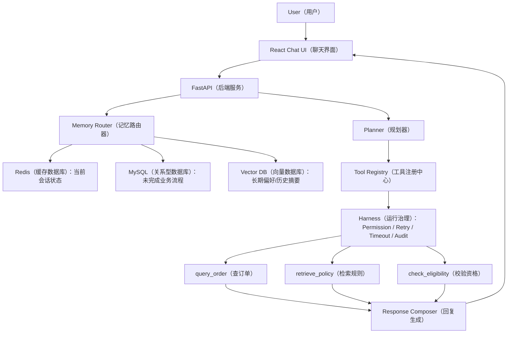

# Agent Workbench MVP

项目定位：基于项目A的电商智能客服经验，升级成一个面向电商客服/运营人员的 Agent Workbench（智能体工作台）最小闭环。

当前版本实现第一周 MVP：

- React Chat UI（聊天界面）
- FastAPI backend（后端服务）
- Planner（规划器）：把用户问题拆成任务链表
- Tool Registry（工具注册中心）：统一注册工具定义
- 三个原子工具：
  - `query_order`：查订单
  - `retrieve_policy`：检索规则
  - `check_eligibility`：校验售后资格
- Task Timeline（任务时间线）
- Tool Call Trace（工具调用链路）

当前 `agent-harness` 分支实现第二周能力：

- Agent Harness（智能体运行治理框架）雏形
- Tool Registry（工具注册中心）标准化工具定义
- 每个工具包含：
  - `name`（名称）
  - `description`（描述）
  - `input_schema`（输入结构）
  - `output_schema`（输出结构）
  - `permission`（权限）
  - `retry`（重试）
  - `timeout`（超时）
  - `audit_log`（审计日志）
- 统一工具执行入口：权限检查、超时控制、失败重试、审计事件生成

当前 `memory-router` 分支实现第三周能力：

- Memory（记忆）三层存储设计
  - Redis（缓存数据库）：当前会话状态，比如当前意图、槽位、轮次、最后一句话
  - MySQL（关系型数据库）：未完成业务流程，比如退货流程已经校验完成但等待用户确认
  - Vector DB（向量数据库）：长期偏好和历史摘要，比如常用地址、历史售后摘要
- Memory Router（记忆路由器）：根据用户问题判断是否需要查长期记忆
- 本地 MVP 使用可替换适配层：
  - `RedisSessionStore` 模拟 Redis 会话缓存
  - `BusinessFlowStore` 使用 SQLite 做 MySQL 形态的本地关系存储
  - `VectorMemoryStore` 使用轻量向量相似度做长期记忆检索

## 架构



## 本地运行

```bash
cd /Users/zhoujiaying/Documents/Codex/agent-workbench-mvp
python3 -m venv .venv
.venv/bin/python -m pip install -r backend/requirements.txt
.venv/bin/python -m uvicorn backend.app.main:app --reload --port 8020
```

打开：

```text
http://127.0.0.1:8020
```

## 可测试问题

```text
手机签收八天了还能退吗？
查一下订单 202606150001
我想退货，订单号 202606150002
给我寄过来
以后都寄到这个地址，帮我记住
```

## 下一阶段计划

- Memory Router（记忆路由器）
- Guardrail（护栏）：隐私、越权、危险动作确认
- Trace Dashboard（链路追踪看板）
- Evaluation（评测集）
- DAG（有向无环图）并行执行
- MCP（模型上下文协议）工具接入
